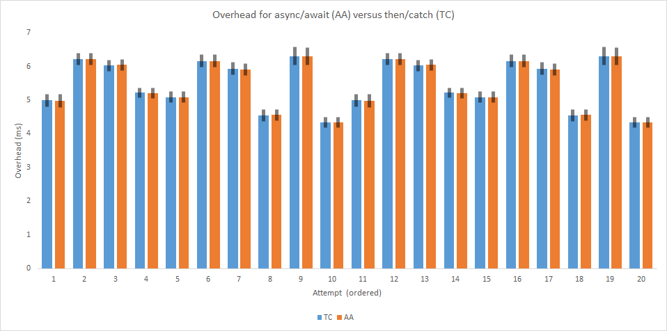

# Comparing performance of `async`/`await` versus `.then`/`.catch`

## Introduction

I was told by a colleague that `async`/`await` (AA) is the new `.then`/`.catch` (TC). Looking for evidence for this I immediately came across [the great debate](https://itnext.io/javascripts-async-await-versus-promise-the-great-debate-6308cb2e10b3). In there, Paige Niedringhaus
 mentions that the one fact that could convince his colleagues to switch to `async`/`await` was a performance benefit. So I set out to test just that.

## The Test

First, I wrote a simple asynchronous function:

```js
const away = (i, delay) => {
	return new Promise(resolve => {
		setTimeout(resolve.bind(null, i), delay);
	});
};
```

Then, designed a scenario for using `async`/`await` (AA) versus `.then`/`.catch` (TC), both as comparable as I could make them:

```js
const tc = (i, delay) => {
	const startTC = performance.now();
	return away(i, delay)
		.then(i => {
			spansTC[i] = performance.now() - startTC - delay;
		})
		.catch(i => {
			console.error("TC error in " + i);
		});
};

const aa = async (i, delay) => {
	const startAA = performance.now();
	try {
		await away(i, delay);
		spansAA[i] = performance.now() - startAA - delay;
	} catch (error) {
		console.error("AA error in " + i);
	}
};
```

Note that `i` is a simple identifier to track what 'thread' is returning when and `delay` is a delay time span uniformly distributed in the range [0, `MAX_DELAY`]. Now, I would loop `N` times over both functions in random order:

```js
for (let i = 0; i < N; i++) {
	const delay = delays[i];
	[first, second] = delay <= MAX_DELAY / 2 ? [tc, aa] : [aa, tc];
	first(i, delays[i]);
	second(i, delays[i]);
}
```

Finally, I print the mean &plusmn; SEM of the overhead times (`performance.now() - startTC - delay`):

```js
setTimeout(() => {
	console.log("meanSpansTC: " + printMean(spansTC));
	console.log("meanSpansAA: " + printMean(spansAA));
}, MAX_DELAY + 500);
```

(see [code attached](Promise.js) for full listing).

## Conclusion

Running the above loop several time in the console of my browser I got the following overhead times:

| TC            | AA            |
| ------------- | ------------- |
| 4.997 ± 0.186 | 4.978 ± 0.187 |
| 6.219 ± 0.168 | 6.214 ± 0.169 |
| 6.024 ± 0.169 | 6.043 ± 0.169 |
| 5.218 ± 0.152 | 5.209 ± 0.153 |
| 5.087 ± 0.162 | 5.086 ± 0.161 |
| 6.16 ± 0.186  | 6.164 ± 0.186 |
| 5.937 ± 0.177 | 5.912 ± 0.175 |
| 4.545 ± 0.169 | 4.558 ± 0.17  |
| 6.304 ± 0.265 | 6.301 ± 0.265 |
| 4.335 ± 0.156 | 4.336 ± 0.156 |
| 4.997 ± 0.186 | 4.978 ± 0.187 |
| 6.219 ± 0.168 | 6.214 ± 0.169 |
| 6.024 ± 0.169 | 6.043 ± 0.169 |
| 5.218 ± 0.152 | 5.209 ± 0.153 |
| 5.087 ± 0.162 | 5.086 ± 0.161 |
| 6.16 ± 0.186  | 6.164 ± 0.186 |
| 5.937 ± 0.177 | 5.912 ± 0.175 |
| 4.545 ± 0.169 | 4.558 ± 0.17  |
| 6.304 ± 0.265 | 6.301 ± 0.265 |
| 4.335 ± 0.156 | 4.336 ± 0.156 |

And here is the graph of the same data:



So no difference in overhead.
